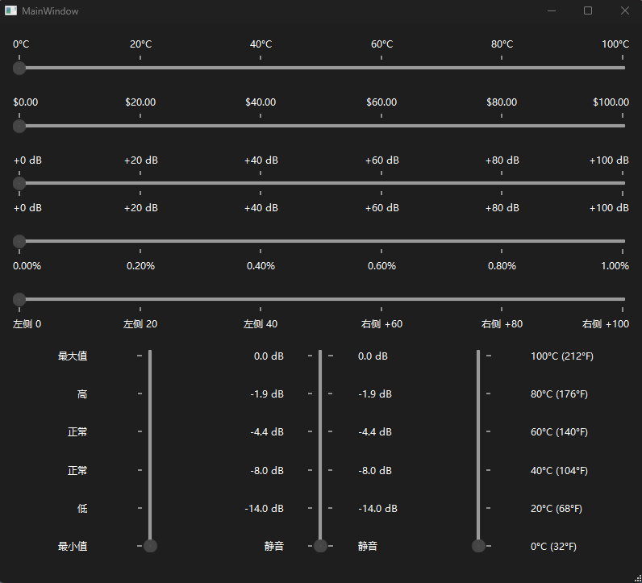

## LabelSlider（Qt 带标签的可定制刻度值滑块）

<p align="center">
  <a href="README.md">English</a> | <a href="README_CN.md">中文</a>
</p>

<p align="center">
  
</p>

一个基于Qt的带标签滑块组件，在刻度位置显示可定制格式化的数值，为数值选择提供增强的用户体验和视觉反馈。

### 特性

- 📊 在滑块刻度位置自动生成标签
- 🎨 多种格式化类型：简单格式、前缀后缀、Printf风格、自定义函数和自定义映射
- 🔢 灵活的数值缩放和小数位数控制
- 📐 支持水平和垂直方向
- 🎯 可配置的刻度位置：上方、下方、左侧、右侧或两侧
- ⚡ 滑块属性改变时实时更新标签
- 🔄 兼容 Qt 5 和 Qt 6

### 应用场景

- 🎚️ **音频控制**: 带dB值的音量滑块、带Hz标签的频率控制
- 🌡️ **温度控制**: 带°C/°F指示器的温控器
- 💰 **金融应用**: 带货币符号的价格滑块
- 🎮 **游戏界面**: 带百分比或等级指示器的设置面板
- 📊 **数据可视化**: 带标签值范围的交互式图表
- ⚙️ **工程工具**: 带单位标签的校准界面

### 环境要求

- Qt 5.6+ 或 Qt 6.x（Widgets）
- C++11 或更高
- 平台：Windows、macOS、Linux

### 集成方式

1. 将 `labelslider.h` 和 `labelslider.cpp` 复制到您的Qt项目中
2. 在代码中包含头文件：
   ```cpp
   #include "labelslider.h"
   ```
3. 将文件添加到项目的构建系统中（CMake、qmake等）

#### qmake (.pro)

```pro
QT += widgets

SOURCES += \
    labelslider.cpp

HEADERS += \
    labelslider.h
```

#### CMake（Qt 6）

```cmake
find_package(Qt6 REQUIRED COMPONENTS Widgets)

target_sources(your_target PRIVATE
    ${CMAKE_CURRENT_SOURCE_DIR}/labelslider.cpp
)

target_include_directories(your_target PRIVATE
    ${CMAKE_CURRENT_SOURCE_DIR}
)

target_link_libraries(your_target PRIVATE Qt6::Widgets)
```

#### CMake（Qt 5）

```cmake
find_package(Qt5 REQUIRED COMPONENTS Widgets)

target_sources(your_target PRIVATE
    ${CMAKE_CURRENT_SOURCE_DIR}/labelslider.cpp
)

target_include_directories(your_target PRIVATE
    ${CMAKE_CURRENT_SOURCE_DIR}
)

target_link_libraries(your_target PRIVATE Qt5::Widgets)
```

### 使用示例

#### 基本设置

```cpp
#include "labelslider.h"
#include <QWidget>
#include <QVBoxLayout>
#include <QLabel>

class DemoWidget : public QWidget {
    Q_OBJECT
public:
    DemoWidget() {
        auto *layout = new QVBoxLayout(this);
        auto *valueLabel = new QLabel("数值: 0", this);
        auto *slider = new LabelSlider(Qt::Horizontal, this);

        // 基本配置
        slider->setRange(-10, 10);
        slider->setTickInterval(5);
        slider->setTickPosition(QSlider::TicksBelow);
        slider->setTickValuesVisible(true);

        connect(slider, &LabelSlider::valueChanged, this, [valueLabel](int value) {
            valueLabel->setText(QString("数值: %1").arg(value));
        });

        layout->addWidget(valueLabel);
        layout->addWidget(slider);
        setLayout(layout);
    }
};
```

#### 详细格式化示例

```cpp
LabelSlider *slider = new LabelSlider();
slider->setRange(-100, 100);
slider->setTickInterval(25);
slider->setTickPosition(QSlider::TicksBelow);
slider->setTickValuesVisible(true);

// 1. 简单后缀格式
slider->setFormatType(LabelSlider::SimpleFormat);
slider->setFormatSuffix("°C");  // 显示：-100°C, -75°C, -50°C, -25°C, 0°C, 25°C, 50°C, 75°C, 100°C

// 2. 前缀和后缀格式
slider->setFormatType(LabelSlider::PrefixSuffixFormat);
slider->setFormatPrefixSuffix("$", ".00");  // 显示：$-100.00, $-75.00, $-50.00, ..., $100.00

// 3. Printf 风格格式化
slider->setFormatType(LabelSlider::PrintfFormat);
slider->setPrintfFormat("%+d dB");  // 显示：-100 dB, -75 dB, -50 dB, ..., +100 dB

// 4. 数值缩放和小数位数
slider->setFormatType(LabelSlider::SimpleFormat);  // 使用简单格式以配合后缀和小数位
slider->setValueScale(0.01);  // 将整数值缩放为小数（除以100）
slider->setDecimalPlaces(2);  // 显示两位小数
slider->setFormatSuffix("%");
// 结果：-1.00%, -0.75%, -0.50%, ..., 1.00%

// 5. 自定义格式化函数
slider->setFormatType(LabelSlider::CustomFunction);
slider->setCustomFormatter([](int value) -> QString {
    if (value == 0) return "中心";
    if (value > 0) return QString("右侧 +%1").arg(value);
    return QString("左侧 %1").arg(value);
});
// 结果："左侧 -100", "左侧 -75", ..., "中心", ..., "右侧 +75", "右侧 +100"

// 6. 完全自定义标签映射
slider->setFormatType(LabelSlider::CustomMapping);
slider->setCustomLabel(-100, "最小值");
slider->setCustomLabel(-50, "低");
slider->setCustomLabel(0, "正常");
slider->setCustomLabel(50, "高");
slider->setCustomLabel(100, "最大值");
// 结果："最小值", "低", "正常", "高", "最大值"

// 7. 音频音量示例（对数感觉）
LabelSlider *volumeSlider = new LabelSlider();
volumeSlider->setRange(0, 100);
volumeSlider->setTickInterval(20);
volumeSlider->setFormatType(LabelSlider::CustomFunction);
volumeSlider->setCustomFormatter([](int value) -> QString {
    if (value == 0) return "静音";
    // 将线性滑块转换为对数dB刻度
    double db = 20.0 * log10(value / 100.0);
    return QString("%1 dB").arg(db, 0, 'f', 1);
});

// 8. 带不同温度刻度的温度计
LabelSlider *tempSlider = new LabelSlider();
tempSlider->setRange(-40, 50);  // 摄氏度范围
tempSlider->setTickInterval(15);
tempSlider->setFormatType(LabelSlider::CustomFunction);
tempSlider->setCustomFormatter([](int celsius) -> QString {
    int fahrenheit = celsius * 9 / 5 + 32;
    return QString("%1°C (%2°F)").arg(celsius).arg(fahrenheit);
});
```

### API 概览

#### 构造函数
- `LabelSlider(QWidget *parent = nullptr)`
- `LabelSlider(Qt::Orientation orientation, QWidget *parent = nullptr)`

#### 滑块属性
- `void setRange(int min, int max)`
- `void setMinimum(int min)` / `int minimum() const`
- `void setMaximum(int max)` / `int maximum() const`
- `void setValue(int value)` / `int value() const`
- `void setOrientation(Qt::Orientation)` / `Qt::Orientation orientation() const`

#### 刻度配置
- `void setTickPosition(QSlider::TickPosition position)` / `QSlider::TickPosition tickPosition() const`
- `void setTickInterval(int interval)` / `int tickInterval() const`
- `void setTickValuesVisible(bool visible)` / `bool tickValuesVisible() const`

#### 格式化选项
- `void setFormatType(FormatType type)` / `FormatType formatType() const`
- `void setFormatSuffix(const QString &suffix)` / `QString formatSuffix() const`
- `void setFormatPrefixSuffix(const QString &prefix, const QString &suffix)`
- `QString formatPrefix() const`
- `void setPrintfFormat(const QString &format)` / `QString printfFormat() const`
- `void setDecimalPlaces(int places)` / `int decimalPlaces() const`
- `void setValueScale(double scale)` / `double valueScale() const`

#### 自定义格式化
- `void setCustomFormatter(std::function<QString(int)> formatter)`
- `void setCustomLabels(const QMap<int, QString> &labels)` / `QMap<int, QString> customLabels() const`
- `void setCustomLabel(int value, const QString &label)`
- `void clearCustomLabels()`

#### 信号
- `void valueChanged(int value)`
- `void sliderMoved(int position)`
- `void sliderPressed()`
- `void sliderReleased()`
- `void rangeChanged(int min, int max)`
- `void actionTriggered(QAbstractSlider::SliderAction action)`

### 格式类型

1. **SimpleFormat（简单格式）**: 数值 + 后缀（如："25°C"）
2. **PrefixSuffixFormat（前缀后缀格式）**: 前缀 + 数值 + 后缀（如："$25.00"）
3. **PrintfFormat（Printf格式）**: Printf风格格式化（如："%+d dB" → "+25 dB"）
4. **CustomFunction（自定义函数）**: 用户自定义格式化函数
5. **CustomMapping（自定义映射）**: 直接的数值到字符串映射

### 注意事项

- 该组件使用了 `Q_OBJECT` 和自定义信号，需要运行MOC（作为Qt项目的一部分构建）。
- 标签会根据刻度位置和滑块方向自动定位。
- 当 `tickValuesVisible()` 为 false 时，无论其他设置如何都不会显示标签。
- 当相关属性发生变化时，组件会自动重建标签。
- 对于垂直滑块，左侧标签右对齐，右侧标签左对齐。
- `setDecimalPlaces()` 仅对 `SimpleFormat` 和 `PrefixSuffixFormat` 生效；`PrintfFormat` 请在格式串中控制精度（例如 `"%.2f"`）。

### 使用技巧

- 使用 `setValueScale()` 将整数滑块值转换为有意义的小数范围
- 结合使用 `setDecimalPlaces()` 和 `setValueScale()` 以实现精确的小数格式化
- 自定义格式化器为复杂的格式化需求提供最大的灵活性
- 为了在标签数量较多时保持性能，考虑使用较少的刻度间隔

### 规划/想法

- 支持非均匀刻度间距
- 可选的标签旋转以实现紧凑显示
- 标签中的富文本格式支持
- 动画标签更新
- 主题感知的样式选项

### 参与贡献

欢迎提交问题和拉取请求。请包含以下信息：
- 问题或功能增强的清晰描述
- 复现步骤（如适用）
- 平台和Qt版本信息
- 相关的代码示例 